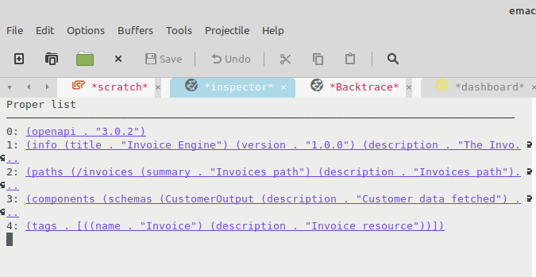

# EMACS-INSPECTOR

## Overview

Inspector tool for Emacs Lisp objects.

Similar to inspectors available for Smalltalk and Common Lisp, but for Emacs Lisp.

DEMO VIDEO: https://drive.google.com/file/d/1808JlDM0q-aW4woZQBscatxp6omIR2j8/view



## Installation

This is work in progress at the moment. Just download and load the file into Emacs for now.

### Via el-get

This is the [el-get](https://www.emacswiki.org/emacs/el-get "el-get") recipe:

```lisp
(push '(:name emacs-inspector
       :type git
       :url "git://github.com/mmontone/emacs-inspector.git"
       :features inspector
       :compile "inspector.el")
      el-get-sources)
```

## Usage

### Invocation

* `M-x inspect-expression` to evaluate an elisp expression and inspect the result.
* `M-x inspect-last-sexp` to evaluate last sexp in current buffer and inspect the result.

### Inside the inspector

* `M-x inspector-pop` bound to letter `l`, to navigate to previous object.
* `M-x inspector-quit` bound to letter `q`, to exit the inspector.

Also, `M-x forward-button` and `M-x backward-button` are conveniently bound to `n` and `p`. 
They can be used for fast navigation across the buttons that the inspector displays.

Finally, you can use `M-x eval-expression` bound to letter `e`, to evaluate an elisp expression using the object currently being inspected (it is bound to `*`).

### From the Emacs debugger

When on an Emacs debugging backtrace, press letter `i` to inspect the pointed frame and its local variables.
