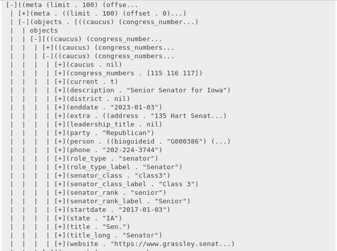

# EMACS-INSPECTOR


## Overview

Inspector tool for Emacs Lisp objects.

Similar to inspectors available for Smalltalk and Common Lisp, but for Emacs Lisp.


## Installation

This package is available from ELPA.

`M-x package-install RET inspector RET`

## Usage

### Invocation

* `M-x inspector-inspect-expression` to evaluate an elisp expression and inspect the result.
* `M-x inspector-inspect-last-sexp` to evaluate last sexp in current buffer and inspect the result.

 Or add the following to your config:

```lisp
(define-key global-map [remap eval-last-sexp] #'inspector-eval-last-sexp)
(define-key global-map [remap eval-expression] #'inspector-eval-expression)
```

and then use `C-u C-x C-e` and `C-u M-:` as alternatives to
`eval-last-sexp` and `eval-expression`.

### Inside the inspector

* `M-x inspector-pop` bound to letter `l`, to navigate to previous object.
* `M-x inspector-quit` bound to letter `q`, to exit the inspector.

Also, `M-x forward-button` and `M-x backward-button` are conveniently bound to `n` and `p`. 
They can be used for fast navigation across the buttons that the inspector displays.

Finally, you can use `M-x eval-expression` bound to letter `e`, to evaluate an elisp expression using the object currently being inspected (it is bound to `*`).

### From the Emacs debugger

When on an Emacs debugging backtrace, press letter `i` to inspect the pointed frame and its local variables.

When on edebug-mode, use `C-c C-i` for inspecting expressions in the debugger.

# Tree Inspector

An inspector tool for Emacs Lisp objects that uses a tree view.



Works together with the "normal" inspector when it is loaded; when an object label is clicked on the tree, an inspector is opened on that object.

## Install and usage

`(require 'tree-inspector)` to load.

Then start the inspector with either `M-x tree-inspector-inspect-expression` or `M-x tree-inspector-inspect-last-sexp`.

### For `evil/vim` user

- Add this to your config file
```emacs-lisp
;; Add evil keybindings to inspector-mode
(defun inspector--set-evil-key-binding ()
"Set evil keybindings for inspector-mode if in Evil mode."
        (when (bound-and-true-p evil-mode)
        (evil-define-key 'normal inspector-mode-map
        "q" #'inspector-quit
        "l" #'inspector-pop
        "e" #'eval-expression
        "n" #'forward-button
        "p" #'backward-button
        "P" #'inspector-pprint-inspected-object)))
)
(add-hook 'inspector-mode-hook #'inspector--set-evil-key-binding)
```

